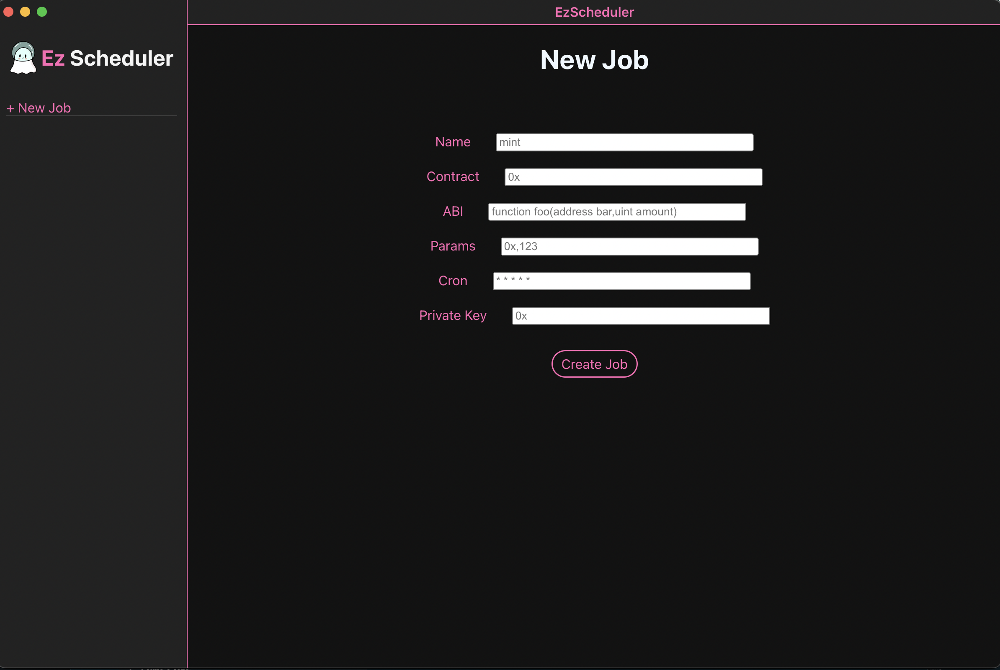
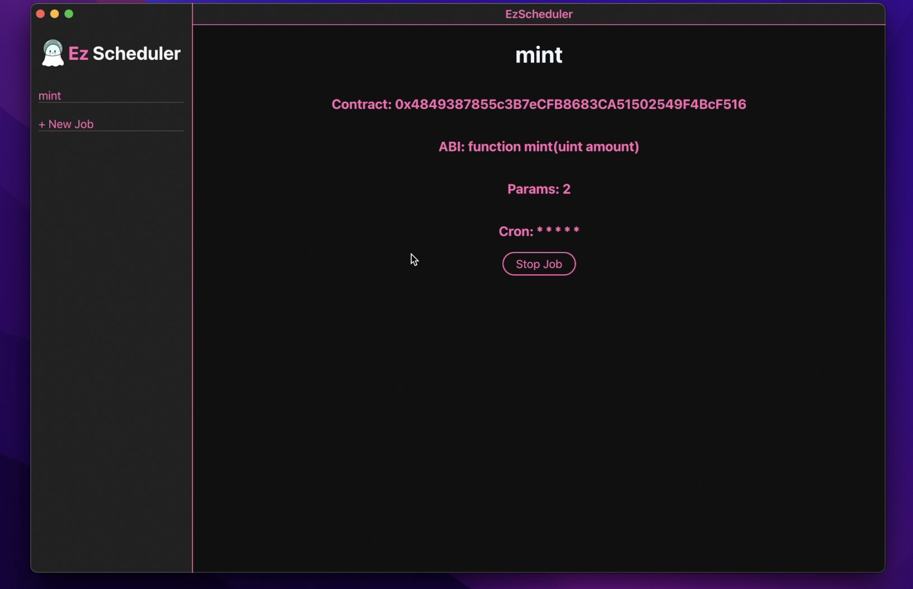

# Ez Scheduler

This is a cron job maker application that allows users to schedule their transactions on chain without relying on external services through a simple GUI.

[](https://youtu.be/j4X0DMjiu_U "Demo Video")


To run it locally:

```
npm run electron:serve
```

Note: This is a hackathon build, made specifically for Mantle Mash Hackathon, it is likely not finished and may contain security issues, please do not use it for high stake transactions.

---

To discuss this project further, contact me on discord: Ace011#5743
